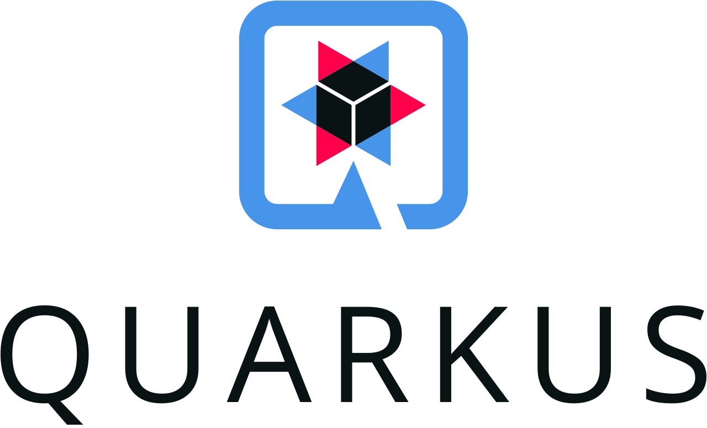

<h1 align="center">Hola, soy Lautaro 👋</h1>

  Backend Developer | Apasionado por la tecnología y en crear soluciones

---

### 🧠 Sobre mí

- 🎓 Estudiante en la Universidad Tecnológica Nacional de Mar del Plata - Técnico  en programación
- 🛠️ Actualmente desarrollando **KeyLab**, una API Rest en java (Spring Boot) para un e-commerce de teclados custom.
- 💡 Enfocado en el desarrollo backend de soluciones escalables, orientadas a múltiples usuarios y pensadas para crecer.

---

### 🧰 Tecnologías que domino

  
**🎨 Frontend**

  
**🧠 Backend**

**💾 Base de Datos**

**🧾 Versionado**

**🧪 Testing y herramientas para APIs**

---

### 📈 GitHub Stats

  
  

---

---

### 📫 Contacto

- 💼 [LinkedIn](https://www.linkedin.com/in/LautaroOrellano)
- 📬 Email: LautaroOrellanoDev@gmail.com

